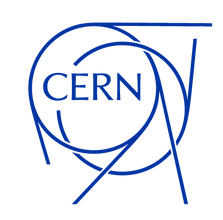

{width=300px}
/// caption
Dr. Michael Betz
///

# 🔧 Work experience

{width=150px align=right}

__since 04/2021__ Senior Electronics Engineer at [Terapet SA](https://terapet.ch), Switzerland. Design and realization of a gamma-ray imaging device to improve accuracy and safety in proton therapy

{width=150px align=right}

__11/2016 - 04/2021__ Senior Electronics Engineer at [Lawrence Berkeley Labs](https://www.lbl.gov/), California.

  * Upgrade of the master-oscillator and distribution systems. Phase-noise and jitter measurements
  * Integration of a new digital LLRF system into the storage ring
  * Major upgrades and EPICS integration of the PLC-based control system
  * Setting up an archiving server and analysis tools for rapid troubleshooting of faults
  * Interlock design for machine and personal protection
  * RF measurements (also beam-based) on cavities, stripline-kickers and high power amplifiers
  * Contributions to an open-source FPGA carrier board (Marble) and HDL library for accelerator control systems (Bedrock)

{width=120px align=right}

__01/2014 - 11/2016__ Electrical engineer at [CERN](https://home.cern/), Switzerland. LHC Beam Instrumentation group.

  * Major upgrades to a Schottky noise beam diagnostic system which measures tune and chromaticity of the LHC bunched proton beam in a non-invasive way

# 📖 Education
{width=120px align=right}

__01/2011 - 01/2014__ PhD in Electrical Engineering at the [Karlsruhe Institute of Technology](https://www.kit.edu/) / CERN

  * Graduated with summa cum laude.
  * ITG-Förderpreis 2015 by the German Association for Electrical, Electronic and Information Technologies (VDE e.V.). Yearly award
      for outstanding dissertations.

__03/2009 - 10/2010__ Masters in Electrical Engineering at the Hochschule Karlsruhe, Germany. Specialized on Information and communication technology

# ⚙️ Previous Projects

In previous projects he worked with

  * Large scale, decentralized control systems for accelerators _(like EPICS or FESA)_
  * Industrial Programmable Logic controllers _(PLCs)_ and field-bus interfaces
  * Accelerator __interlock systems__ for personal and machine protection
  * Microwave __receiver front-ends__ with very low noise and very high dynamic range
  * __RF feedback systems__ to control phase and amplitude with
    high precision and sub-ms latency
  * Custom-designed instruments for pulsed RF measurements (amplitude and phase)
  * __Embedded Linux__ on Xilinx devices _(Debian, Yocto, Buildroot, Docker)_
  * ADC and DAC interfacing to FPGAs _(LVDS, JESD204)_
  * Low latency __signal processing in FPGAs__
  * __Soft-CPU integration__ in FPGAs _(PicoRV32, VexRiscv)_
  * __Embedded software development__ _(Atmega, ESP32, ARM Cortex-M4, RiscV)_
  * Design of secure and cost-optimized IOT systems _(ESP32, MQTT, TLS)_
  * High-throughput event processing systems for gamma-ray detectors
  * __Certified radiation protection expert__ in Switzerland
