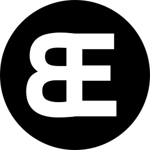
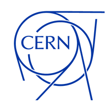
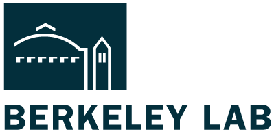
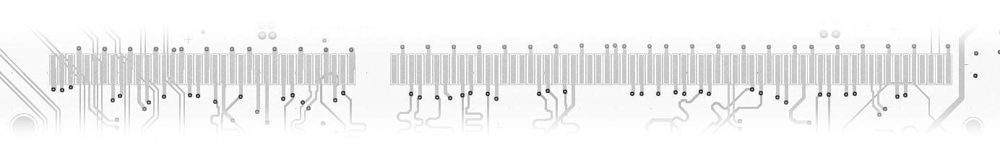

# Dr. Michael Betz
{width=150px align=right}

_Electrical Engineering Consultant_

I help companies bring complex electronics to life — from first concept to working prototype and beyond.

Whether you're planning a new product, improving an existing one, or need expert help on a niche technical challenge, I can support you at every step.

## ⚙️ Hardware Design
- Full-stack embedded systems: hardware (PCBs), firmware, drivers, and interfaces
- Cost-optimized embedded devices for low-power or battery-operated applications
- Sensor networks and secure communication solutions
- High-performance FPGA-based data acquisition systems
- Design for testing and design for manufacturing experience

**Special focus**: Fast turnaround for one-offs, prototypes, and functional mock-ups
— turning ideas into tangible solutions.

I've also worked extensively with medical devices, and am experienced in designing to **IEC 60601** standards.

## ⚡ Specialized Experience: Particle Accelerators & RF Systems

I’ve contributed to advanced RF systems for some of the world’s most respected research institutions and labs.

### Large Hadron Collider (LHC)
[{width=110px align=right}](https://www.cern.ch)
- Ultra-low-noise microwave front-ends for beam instrumentation
- Coherent phase-locked down-converters
- **Invented and rolled out a user-friendly Python API** that became widely used across CERN for accessing the accelerator control system

### Advanced Light Source (ALS)
[{width=140px align=right}](https://als.lbl.gov/)
- High-power RF systems (Klystrons, IOTs, Tetrodes): commissioning, maintenance & troubleshooting
- Control and safety systems (EPICS, PLCs)
- Developer of an [RF Vector Voltmeter](https://github.com/michael-betz/zed_vvm) used across the facility
- Contributor to [Marble](https://github.com/BerkeleyLab/Marble) and [Bedrock](https://github.com/BerkeleyLab/Bedrock)

### Tarla – Free Electron Laser
[{width=150px align=right}](https://en.tarla-fel.org/)
- Commissioning of a superconducting TESLA cavity
- RF measurements, machine protection and control system design

### Industry
- EMC and EMI pre-compliance testing (CISPR 11, EN 55011)
- Signal processing tools for quality assurance workflows

# Let's Work Together

I'm open to projects of all sizes — from solving a single technical issue to supporting full product development.

📬 **Email me**: [`web@betz-engineering.ch`](mailto:web@betz-engineering.ch)
That’s the fastest way to get in touch.

