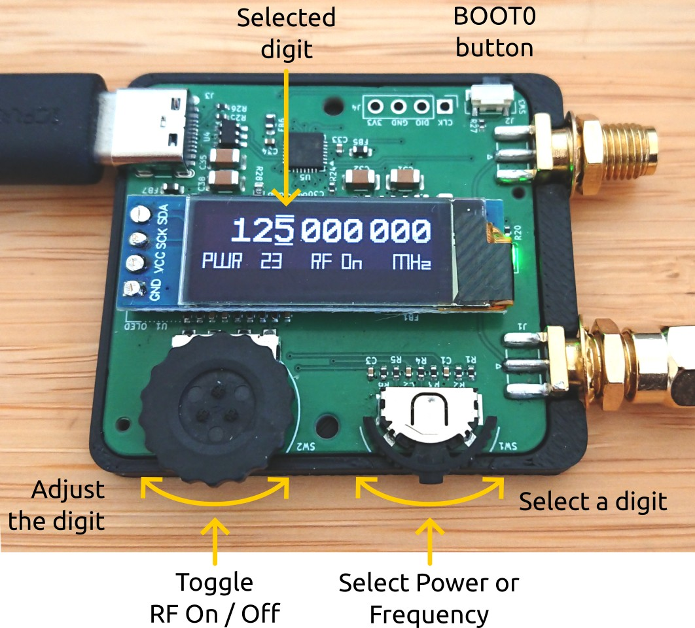

# :material-sine-wave: clock_box

[:material-google-spreadsheet: Schematic](https://github.com/betz-engineering/clock_box/blob/main/pdf/clock_box.pdf){ .md-button }
[:material-layers-triple-outline: Design files](https://github.com/betz-engineering/clock_box/){ .md-button }
[:fontawesome-solid-microchip: Firmware](https://github.com/betz-engineering/clock_box_firmware/){ .md-button }

A handy little clock generator for the RF and digital electronics lab. Use it as an external clock-source for FPGAs, as local oscillator for mixers or as a building block for custom transmitters, receivers or various instrumentation projects.

  * Based on the [__LMX2572__](https://www.ti.com/product/LMX2572) wideband RF synthesizer chip
  * Frequency range: __12.5 MHz - 6.4 GHz__
  * Adjustment resolution: __1 Hz__ (Firmware limitation. Higher resolutions are possible)
  * Typical Jitter: __240 fs__ (within 100 Hz - 40 MHz, better than Si570, see PN plots below)

# User interface

Simple to use: rocker switch selects the digit. Thumb wheel adjusts the digit.

Current frequency and power setting are always shown on the highly readable OLED display.

All user adjustments are stored in non-volatile memory and automatically restored on power-up.

The USB interface enumerates as a serial port. Frequency and power can be read and written with a SCPI-like interface.

Each device has a unique serial number, which allows to tell them apart if several are connected to the same PC.

Open source firmware which can be easily updated through the USB interface (no extra programming adapter needed).

# Output properties
  * Output type: AC-coupled, differential pair (to drive single ended loads, terminate one output with the included 50 Ohm termination)
  * Output power: > 5 dBm into 50 Ohm (800 mV peak to peak). Adjustable in 64 steps.
  * Output waveform: Square wave. Use external filter to remove harmonics if a sine-wave is needed

=== "Wfm @ 125 MHz"
    

=== "PN @ 25 MHz"
    

=== "PN @ 156.25 MHz"
    

=== "PN @ 1 GHz"
    

=== "PN @ 6.4 GHz"
    

## Buying it

You can use the checkout button above (coming soon!) to order this PCB directly from me. If I'm out of stock, please contact me by mail and I will organize a new manufacturing run (with a lead time of around 3 weeks).

The PCBs will be shipped the next day from Switzerland. Please make sure to select the correct shipping charge (within Switzerland, European Union or United States) during checkout.

Here's what's included

  * Fully assembled, programmed and tested clock_box PCB (`Rev: - `)
  * 3D printed casing (black)
  * 1x 50 Ohm SMA termination to terminate the unused output in single-ended mode.

