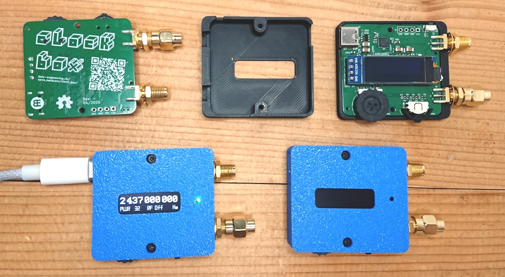
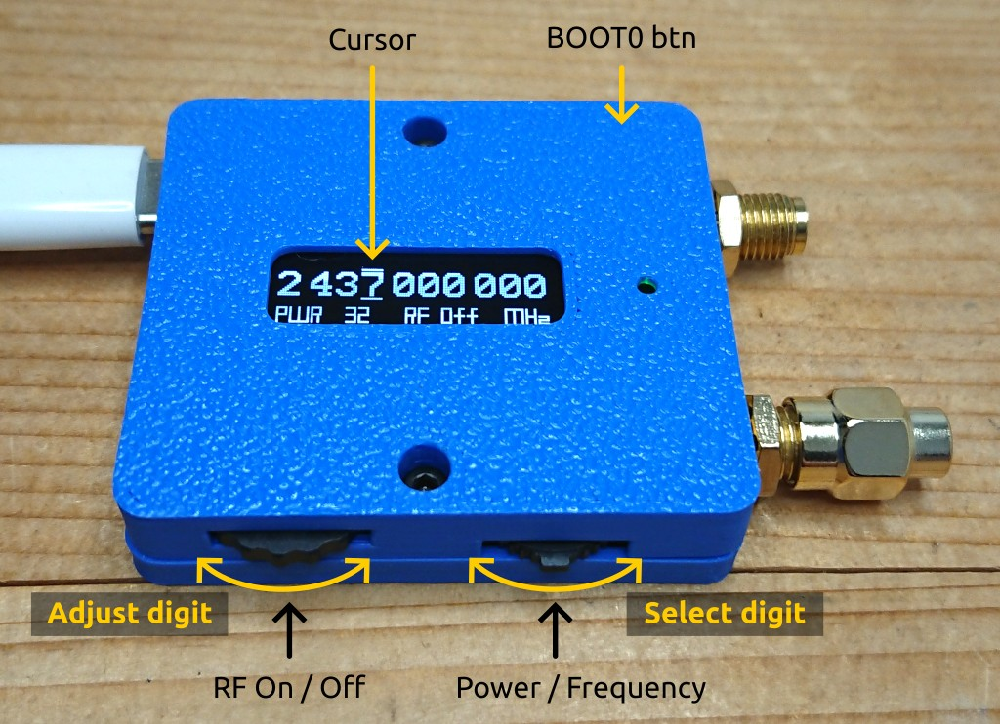
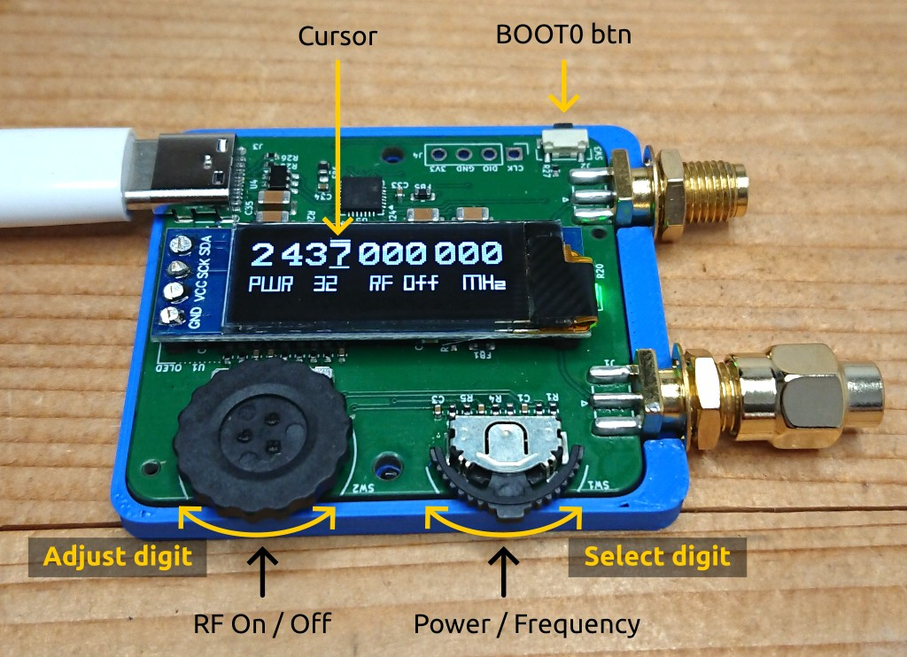
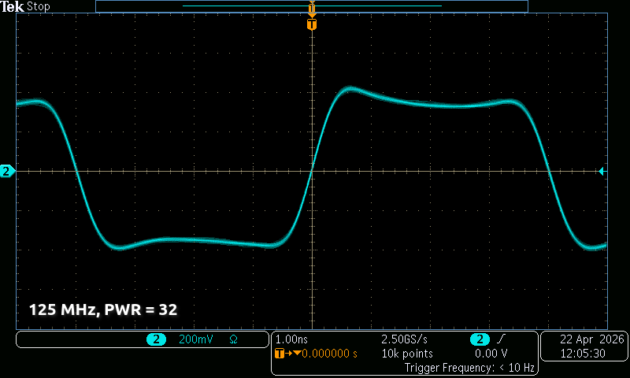
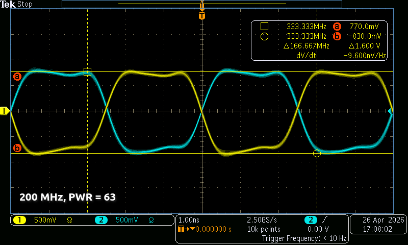
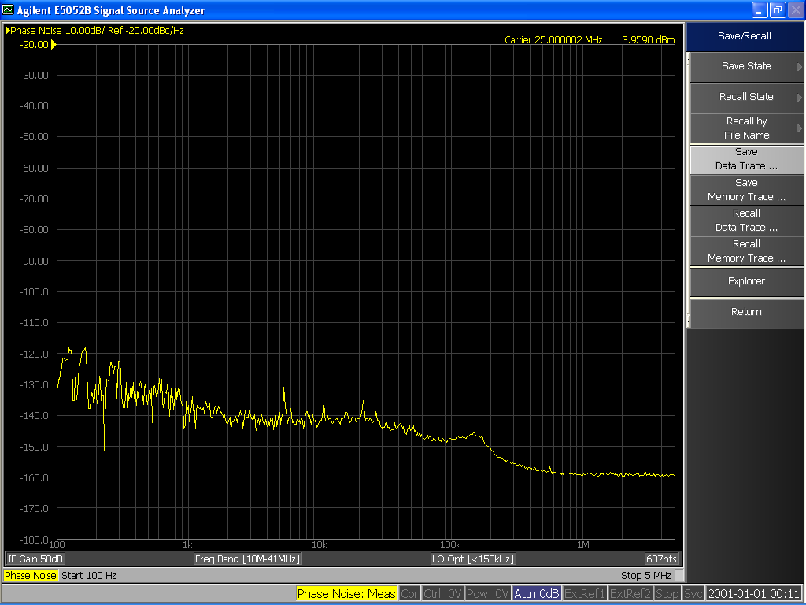
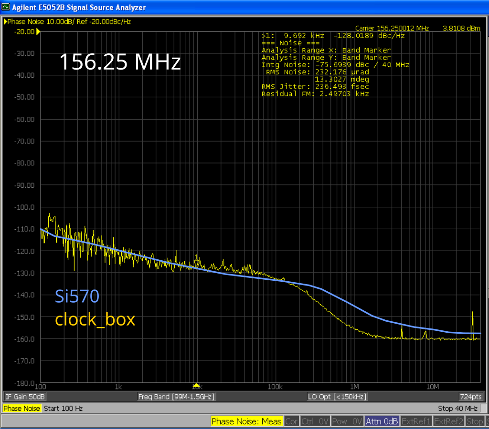
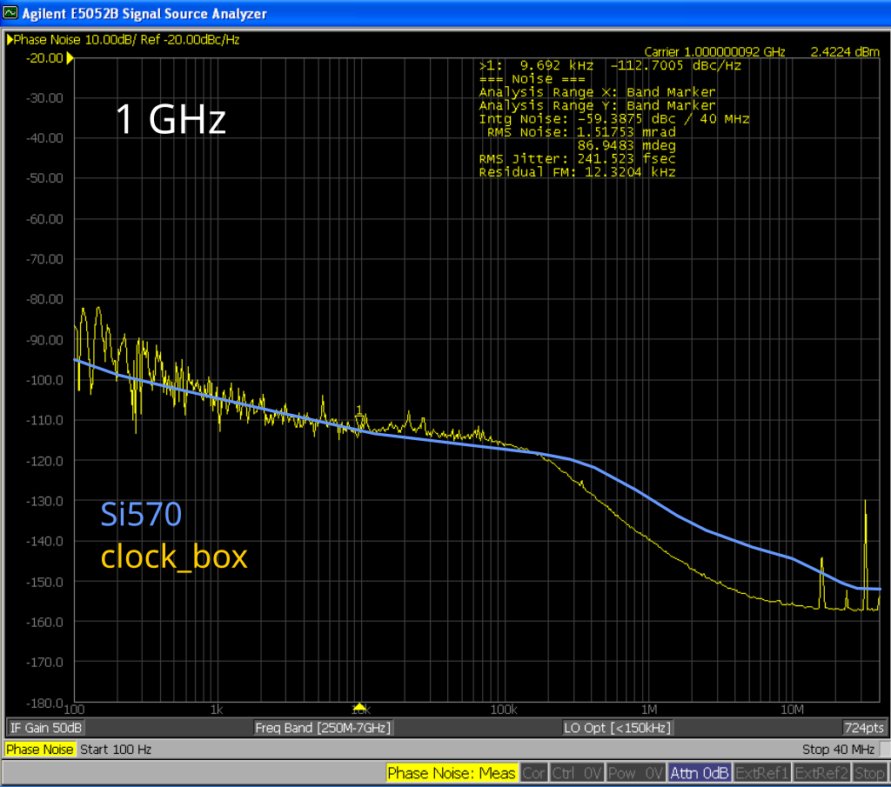
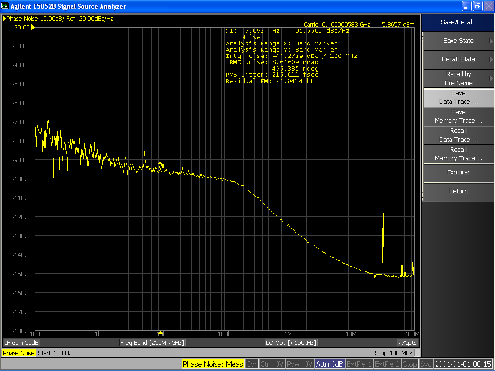

# :material-sine-wave: clock_box

[:material-google-spreadsheet: Schematic](https://github.com/betz-engineering/clock_box/blob/main/pdf/clock_box.pdf){ .md-button }
[:material-layers-triple-outline: PCB](https://github.com/betz-engineering/clock_box/){ .md-button }
[:fontawesome-solid-microchip: Firmware](https://github.com/betz-engineering/clock_box_firmware/){ .md-button }
[:material-printer-3d: Casing](https://github.com/betz-engineering/clock_box/tree/main/casing){ .md-button }

A handy little RF signal generator for the digital electronics lab. Use it as an external clock-source for FPGAs, as local oscillator for mixers or as a building block for custom transmitters, receivers or various instrumentation projects.



  * Based on the [__LMX2572__](https://www.ti.com/product/LMX2572) wideband RF synthesizer chip
  * Frequency range: __12.5 MHz - 6.4 GHz__
  * Adjustment resolution: __1 Hz__ (Firmware limitation. Higher resolutions are possible)
  * Frequency stability: __+- 2.5 ppm__ (-30 &deg;C ... 85 &deg;C)
  * Phase Jitter: __240 fs__ (within 100 Hz - 40 MHz, see Phase Noise plots below)

## User interface

=== "Casing ON"
    

=== "Casing OFF"
    

Simple to use: rocker switch selects the digit. Thumb wheel adjusts the digit.

Current frequency and power setting are always shown on the highly readable OLED display.

All user adjustments are stored in non-volatile memory and automatically restored on power-up.

## Remote control
The USB interface enumerates as a serial port. Frequency and power can be read and written with a very simple SCPI-like interface.

```bash
$ pyserial-miniterm /dev/ttyACM0
--- Miniterm on /dev/ttyACM0  9600,8,N,1 ---
--- Quit: Ctrl+] | Menu: Ctrl+T | Help: Ctrl+T followed by Ctrl+H ---
--- local echo active ---
?
*IDN? = identify
f / f? = set / get frequency [Hz]
p / p? = set / get power [0 - 63]

*IDN?
Betz Engineering,clock_box,R-_CDABABB13ABCB21939E339E3,34d7ac3

f?
2437000000 Hz

f 25000000
OK

f?
  25000000 Hz
```

Each device has an unique serial number, which allows to tell them apart if several are connected to the same PC. In the example above,  `CDABABB13ABCB21939E339E3` is the unique ID and `R-` is the PCB revision.

The [firmware](https://github.com/betz-engineering/clock_box_firmware/) is open source and can be easily updated and modified through the USB interface. No additional programming adapter is needed.

## RF output properties
  * Output type: AC-coupled, differential pair (to drive single ended loads, terminate one output with the included 50 Ohm termination)
  * Output power: 11 dBm (800 mV amplitude) into 50 Ohm at 200 MHz. Adjustable in 64 steps.
  * Output waveform: Square wave. Use external filter to remove harmonics if a sine-wave is needed

=== "Wfm @ 125 MHz"
    

=== "Wfm @ 200 MHz"
    

=== "PN @ 25 MHz"
    

=== "PN @ 156.25 MHz"
    

=== "PN @ 1 GHz"
    

=== "PN @ 6.4 GHz"
    

## Buying it
<span class="shop-ui-button" data-product="clock_box"></span>

You can use the checkout button above to order this device directly from me. If I'm out of stock, please contact me by mail and I will organize a new manufacturing run (with a lead time of around 3 weeks).

✉️✉️✉️

The product will be shipped within a day or two from Switzerland.
Please make sure to select the correct shipping charge during checkout.
Within Switzerland it's free 😎.

Here's what's included

  * Fully assembled, programmed and tested clock_box PCB (`Rev: - `)
  * 3D printed casing
  * 1x 50 Ohm SMA termination to terminate the unused output in single-ended mode.

<script src="../inventory.js"></script>
