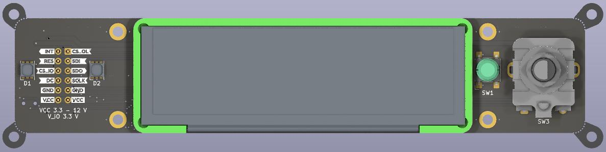

# :simple-opensourcehardware: Open Hardware
Please get in touch if you're interested in buying any of these designs. I may have some boards in stock or can schedule a manufacturing run with reasonably short lead times.

📬 **Email me**: [`web@betz-engineering.ch`](mailto:web@betz-engineering.ch)

-   [:material-clock-digital:{ .lg .middle } __ui_board_1u__](ui_board_1u.md)

    ---

    
    A versatile User Interface solution for chassis front panels, down to 1U height.

-   [:fontawesome-brands-usb:{ .lg .middle } __ui_to_usb__](ui_to_usb.md)

    ---

    
    A USB-interface add-on board for ui_board_1u.

-   [:fontawesome-solid-microchip:{ .lg .middle } __Obsidian A35__](https://github.com/BerkeleyLab/Obsidian)

    ---

    
    A low-cost FPGA carrier board, compatible with Arduino and PMOD extension boards.

