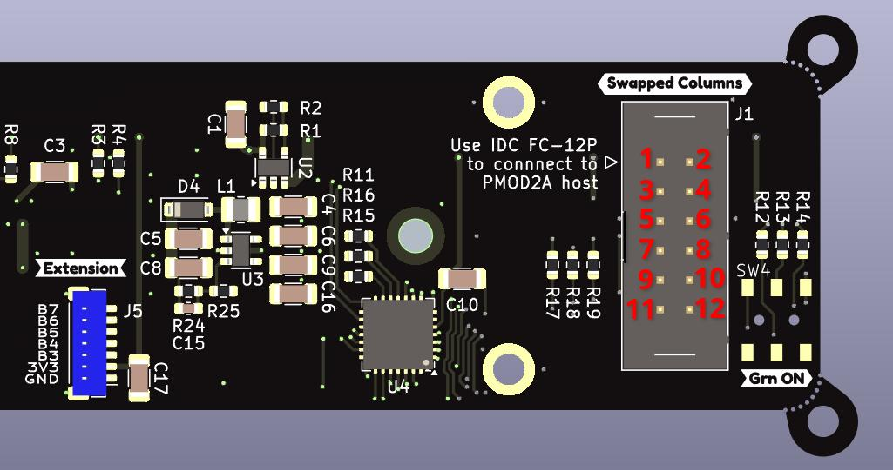

# :material-clock-digital: ui_board_1u

[:material-google-spreadsheet: Schematic](https://github.com/betz-engineering/ui_board_1u/blob/dev/pics/ui_board_1u.pdf){ .md-button }
[:material-layers-triple-outline: Design files](https://github.com/betz-engineering/ui_board_1u){ .md-button }
[:material-file: 3D model](pics/ui_board_1u.step.zip){ .md-button }

A versatile User Interface (UI) for 1U systems

  * 256 x 64 OLED display with high readability
  * Rotary encoder and 2 multi-color status LEDs
  * Proven design. Originated at LBNL and adopted across multiple projects and labs
  * Optimized for 1U chassis. Solves the common problem of fitting a readable display within strict 1U height constraints

/// caption
Dimensions [mm] of the board outline and the position of the mounting holes
///

/// caption
A real world example of a front panel integrating the ui_board
///

## Why it exists
Rack-mount "pizza box" systems often need a simple, reliable way to show status, report errors, and allow basic configuration -- but integrating a front panel UI in a 1U chassis is surprisingly time-consuming.

ui_board_1u exists to remove that friction: it is a ready-to-use, open hardware UI module with a proven mechanical footprint, designed specifically for tight 1U height constraints, so engineers can add a professional front panel interface without reinventing the mechanics, display choice, or software from scratch.

## Front panel integration
The board is mounted with 4x M2.5 hexagonal standoffs. It's critical that they are of __8 mm length__, else the mounting surface of the encoder will not be flush with the front panel.

Here are the recommended cut-outs for the front panel. Note that the blue filled circles represent the M2.5 standoffs.

/// caption
Recommended front panel cut-outs [mm]
///

!!! tip
    To improve the appearance of the rectangular cut-out, round the corners (r = 2 mm) and add chamfering on the edges.

Acrylic light-guides are used to integrate the LEDs into the front panel. They provide some flexibility with respect to the thickness of the front panel and make the PCB easier to manufacture. All orders include light-guides for 5 mm holes.

The board was designed to be mounted on a front panel with a thickness from 2 to 4 mm.

/// caption
Top-down view showing how the ui_board_1u is mounted. The front panel is shown in dark grey, the M2.5 standoffs in red, the LED light-guides in white and the included 3D printed parts in green.
///

!!! info
    A button-cap is included to expose the tactile button to the outside. Note that the button is optional. If it is not required, do not machine the corresponding d5.0 mm hole and do not install the button-cap.

## :ear: What about the ears? :ear:
The _ears_ or _legacy mounting holes_ are included in Rev: - of the PCB to stay compatible with the footprint of the older `ui_board` design, which was used extensively at LBNL.

On the bright side, these mounting holes make the board 100 % compatible with the `ui_board`. The encoder and LEDs were placed in the same location and the pinout is compatible, allowing LBNL to use this board as a replacement-part for the existing chassis.

On the not-so-bright side, these mounting holes prevent the board to be used within the strict height limitations of a 1U chassis. For this use-case, alternative mounting holes have been provided, reducing the board dimensions to 148 x 30 mm. The ears have been perforated, such that they can be broken off and removed rather easily.

## Pinout
When looking at J1 on the bottom side of the PCB, pin 1 is on the top left and marked by a triangle. Pin 2 is on the top right.

The pinout table of J1 is:

| Pin    | IO[^1] | Name      | Comment                                  |
|--------|--------|-----------|------------------------------------------|
| 1      | I      | CS_OLED_N | Chip-select for the SSD1322. Active low  |
| 2      | O      | INT_IO    | Interrupt signal from the MCP23S17       |
| 3      | I      | SDI       | Shared Serial Data Input                 |
| 4      | I      | RES_N     | Shared reset. Active low                 |
| 5      | O      | SDO       | Serial Data Output from the MCP23S17     |
| 6      | I      | CS_IO_N   | Chip-select for the MCP23S17. Active low |
| 7      | I      | SCK       | Shared Serial Clock                      |
| 8      | I      | D_C       | Data / Command selection for the SSD1322 |
| 9, 10  |        | GND       | Common Ground                            |
| 11, 12 |        | VCC       | Supply Voltage, 3.3 V - 12 V, 500 mA     |

[^1]: __I__ = input pin, __O__ = output pin

The PCB is designed to be connected to a PMOD2A host through an __IDC ribbon cable__. These cables provide a 1:1 connection from pin 1 ... N on one side to pin 1 ... N on the other side.

!!! tip
    Pre-assembled ribbon cables can be found by searching for _FC-FD DC4 IDC 2.54mm pitch Male to Female connector_.

!!! warning
    Because ui_board_1u was designed to be used with a ribbon cable, the J1 port is not 100 % PMOD compatible. The PMOD standard anticipates a column swap (even and odd pin numbers are swapped), which originates from the fact that the PMOD host has the female pin receptacle on the PCB top side while the peripheral has the male pin header on the bottom side.

    What this means in practice is that if you connect the ui_board_1u __directly__ to a PMOD port (without using a ribbon cable), it will have its two columns swapped with respect to the PMOD2A expectation. For the supply pins this doesn't matter. For the data pins it is likely that the PMOD host can accommodate this difference in pinout, especially if it is a FPGA board.

## Extras
  * `D1` can serve as a power LED, which is green and always on as soon as power is applied.
To force the green LED on, use SW4.
  * `J5` is an extension connector which provides 3V3 and 5 outputs of the GPIO extender. Use it to connect extra LEDs, switches or buttons.
