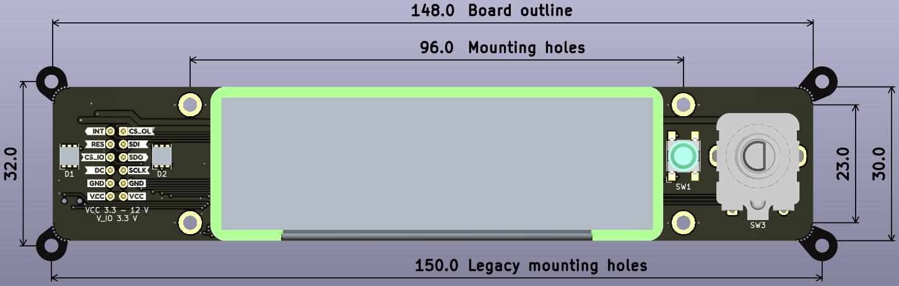

# :material-clock-digital: ui_board_1u

[:material-google-spreadsheet: Schematic](https://github.com/betz-engineering/ui_board_1u/blob/dev/pics/ui_board_1u.pdf){ .md-button }
[:material-layers-triple-outline: Design files](https://github.com/betz-engineering/ui_board_1u){ .md-button }
[:material-file: 3D model](pics/ui_board_1u.step.zip){ .md-button }

A versatile User Interface for 1U Systems

  * 256 x 64 OLED display with high readability
  * Rotary encoder and 2 multi-color status LEDs
  * Proven design. Originated at LBNL and adopted across multiple projects and labs
  * Optimized for 1U chassis. Solves the common problem of fitting a readable display within strict 1U height constraints

/// caption
3D render with the dimensions [mm] of the ui_board_1u
///

/// caption
Example chassis design integrating the ui_board
///

## Why it exists
Rack-mount “pizza box” systems often need a simple, reliable way to show status, report errors, and allow basic configuration -- but integrating a front-panel UI in a 1U chassis is surprisingly time-consuming.

ui_board_1u exists to remove that friction: it is a ready-to-use, open hardware UI module with a proven mechanical footprint, designed specifically for tight 1U height constraints, so engineers can add a professional front-panel interface without reinventing the mechanics, display choice, or software from scratch.

## Front-panel integration
The board is mounted with 4x M2.5 hexagonal standoffs. It's critical that they are of __8 mm length__, else the mounting surface of the encoder will not be flush with the frontpanel.

Here are the recommended cut-outs for the front-panel. Note that the blue filled circles represent the M2.5 standoffs.

/// caption
Recommended front panel cut-outs [mm]
///

To improve the appearance of the rectangular cut-out, I recommend to round the corners and add chamfering on the edges.

Acrylic light-guides are used to integrate the LEDs into the front panel. They provide some flexibility with respect to the thickness of the front-panel and make the PCB easier to manufacture. All orders include light-guides for 5 mm holes.

The board was designed to be mounted on a front-panel with a thickness from 2 to 4 mm.

/// caption
Top-down view on how the ui_board_1u is mounted on a front-panel.
///

In the diagram, the front-panel is shown in dark grey, the M2.5 standoffs in red, the LED light-guides in white.

A button-cap is included to expose the button to the outside. Note that the button is optional, if it is not required, do not machine the corresponding d5.0 mm hole and do not install the button-cap.

## :ear: What about the ears? :ear:
The _ears_ or _legacy mounting holes_ are included in Rev: - of the PCB to stay compatible with the footprint of the older `ui_board` design, which was used extensively at LBNL.

On the bright side, these mounting holes make the board 100 % compatible with the `ui_board`. The encoder and LEDs were placed in the same location and the pinout is compatible, allowing LBNL to use this board as a replacement-part for the existing chassis.

On the not-so-bright side, these mounting holes prevent the board to be used within the strict height limitations of 1U chassis. For this use-case, alternative mounting holes have been provided, reducing the board dimensions to 148 x 30 mm. The ears have been perforated, such that they can be broken off and removed rather easily.
