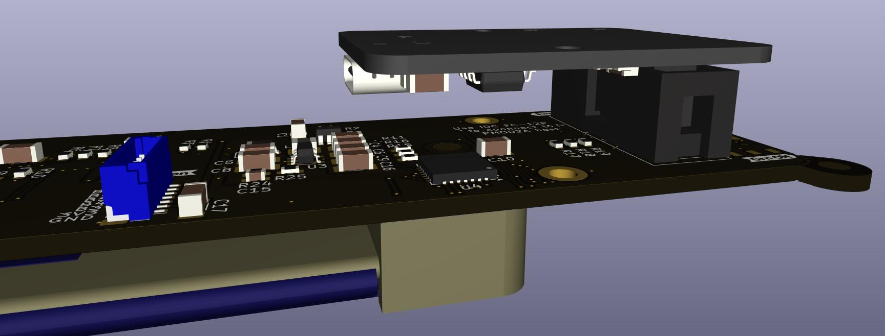

# :fontawesome-brands-usb: ui_to_usb

[:material-google-spreadsheet: Schematic](https://github.com/betz-engineering/ui_to_usb/blob/main/pics/ui_to_usb.pdf){ .md-button }
[:material-layers-triple-outline: Design files](https://github.com/betz-engineering/ui_to_usb){ .md-button }
[:material-file: 3D model](pics/ui_to_usb.step.zip){ .md-button }

A USB Interface Add-On for [ui_board_1u](ui_board_1u.md)

/// caption
Render of the installed ui_to_usb addon board.
///

ui_to_usb enables simple and reliable USB interfacing. It is designed for use with embedded Linux systems such as Linux-based PCs and Zynq FPGA platforms, making it easy to integrate a full user interface into these environments.

The board is fully bus-powered and uses an FT232 USB-to-serial interface, ensuring driver support out of the box on most Linux distributions. This allows rapid setup without custom kernel drivers.

A dedicated user-space library will be provided, demonstrating:

  * Display initialization and drawing
  * Reading the rotary encoder
  * Controlling the onboard LEDs

Beyond embedded systems, ui_to_usb also simplifies PC-based development, making it ideal for prototyping and testing UI code directly on a desktop or laptop.

