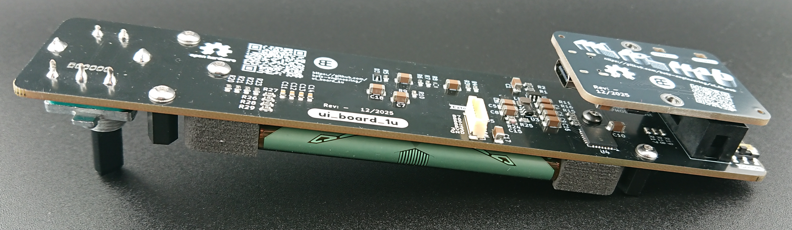
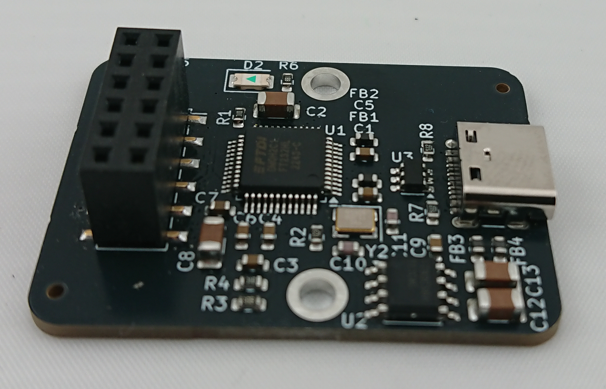

# :fontawesome-brands-usb: ui_to_usb

[:material-google-spreadsheet: Schematic](https://github.com/betz-engineering/ui_to_usb/blob/main/pics/ui_to_usb.pdf){ .md-button }
[:material-layers-triple-outline: Design files](https://github.com/betz-engineering/ui_to_usb){ .md-button }
[:material-file: 3D model](pics/ui_to_usb.step.zip){ .md-button }
[:simple-python: Software support](https://github.com/betz-engineering/ui_to_usb_firmware/){ .md-button }

A USB to PMOD interface. Specifically designed as an add-on for [ui_board_1u](ui_board_1u.md).

The board was designed to easily add a front-panel user interface to embedded Linux systems such as Raspberry Pis, or Zynq FPGAs. However, as it is fully programmable, it can be used as a general purpose interface block to add PMOD extension boards to USB capable hosts.
Beyond embedded systems, ui_to_usb also simplifies PC-based user interface development, making it ideal for prototyping and testing UI code directly on a desktop or laptop.

The board is fully bus-powered and features a CH32V203 RISC-V based microcontroller. Its toolchain is fully open-source and thanks to platform.io support, the firmware can be built and uploaded to the chip with a single command. The chip features a built-in USB bootloader, so no additional programming hardware is necessary.

For the usage with ui_to_usb, a [Python support library](https://github.com/betz-engineering/ui_to_usb_firmware/tree/main/py_ui_board) is provided. It features:

  * Display initialization and anti-aliased drawing
  * Controlling the onboard LEDs
  * Reading the rotary encoder position and button events
  * Negligible CPU usage, as the fast encoder polling happens on the microcontroller

## Buying it

You can use the checkout button above to order this PCB directly from me. If I'm out of stock, please contact me by mail and I will organize a new manufacturing run (with a lead time of around 3 weeks).

The PCBs will be shipped the next day from Switzerland. Please make sure to select the correct shipping charge (within Switzerland, European Union or United States) during checkout.

Here's what's included

  * Fully assembled and tested ui_to_usb
  * 2x nylon standoffs for mounting (M2.5, l = 12 mm)

